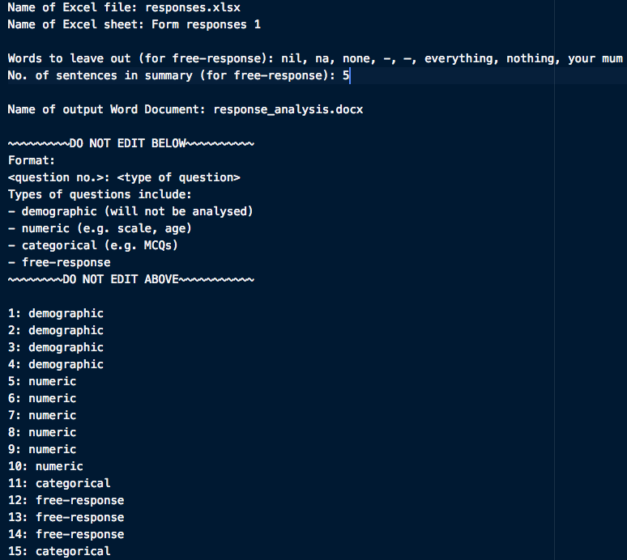
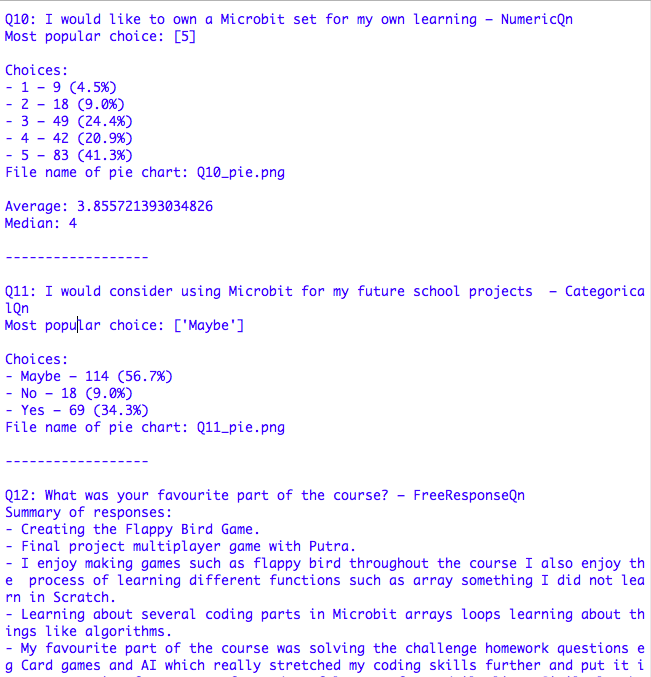
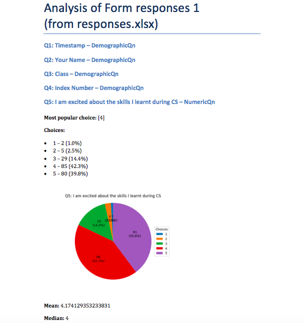

----
## Project Title

CS Feedback Survey Feedback Analysis  
(can be used for other survey analyses too)

----
## Motivations

This project is part of the final project for CEP in year 2.
I chose this project over the other two mainly because I feel like challenging myself to learn more about different libraries.
This can be more useful since these libraries can be used for other projects in the future and since I used them in this project, I would not spend so much time when I use them next time.

----
## Build Status

 * Reading user configurations from the config file – **Works**
 * Reading survey data from the Excel file – **Works**
 * Analysing questions – **Works**
 * Summarising for free response questions – **Works**
 * Creating pie charts for numerical and categorical questions – **Works**  
   *There are some problems with the display of the percentages though*
 * Printing analysis results onto the console – **Works**
 * Writing analysis results onto a Word document – **Works**
 * Doctests – **Works**

----
## Screenshots

##### The config file

##### Analyses for different types of questions (output via console)

##### Word document showing the analysis of the questions (output via Word)

----
## Features

This app categorises questions into 4 categories:
 1. **Demographic Question**  
    *E.g. Questions asking for name and class*  
    Nothing will be done to the data of this category of questions.
 2. **Numeric Question**  
    *E.g. Questions asking for age, Ranking Questions*  
    For these questions, the distribution of responses, mean, median and mode will be displayed.
    A pie chart will also be produced to more clearly show the distribution of responses.
 3. **Categorical Questions**  
    *E.g. Multiple Choice Questions*  
    For these questions, the most popular choice would be pointed out, and the distribution of responses will be displayed.
    A pie chart will also be produced to more clearly show the distribution of responses.
 4. **Free Response Questions**  
    A summary will be produced, showing the responses that most accurately reflect the general response.
    The user can determine the responses to exclude (e.g. "nil") and the number of responses shown in the summary in the config file.

A config file is provided for the user to enter the configurations for the program.  
Afterwards, it will print the data on the console, as well as produce a Microsoft Word document to display the analysis.

----
## Code Examples
\* Note: As I am trying to make the code fit into the required space, some of the colour coding may not be accurate.
Some strings may be broken into 2 or more lines but this does not happen in the actual code.

#### Code used to read the config file
    def readConfig():
        """
        Reads the information from configuration file (config.txt)
        Returns the following information in a list:
        1) The name of the Excel file containing the designated Excel sheet
        2) The name of the Excel sheet to read the data from
        3) The name of the Word document to save the analysis to
        4) A dictionary with the details of each question
           Each entry is arranged as <question no.>: <question type>
        5) A list of strings to leave out from the summary
        6) The number of lines in the summary
        """
        try:
            config = open(configName, "r", encoding="utf-8")
        except:
            print("Error: {} not found".format(configName))
            return "ERROR"
        try:
            filename = str(config.readline().replace("\n", "").split(": ")[1])
        except:
            print("Error on line 1: Please enter the name of a file")
            return "ERROR"
        else:
            if ".xlsx" not in filename:
                print("Error on line 1:
                      Incorrect file type. Your filename should end in '.xlsx'")
                return "ERROR"
        try:
            sheetname = str(config.readline().replace("\n", "").split(": ")[1])
        except:
            print("Error on line 2: Please enter a string")
            return "ERROR"
        config.readline()
        try:
            leaveOut = str(config.readline().replace("\n", "").split(": ")[1])
                       .split(", ")
        except:
            print("Error on line 4:
                  Please enter a list of strings to exclude from the summary")
            return "ERROR"
        try:
            summLen = int(config.readline().replace("\n", "").split(": ")[1].strip())
        except:
            print("Error on line 5:
                  Please enter the number of lines you want in your summary")
            return "ERROR"
        config.readline()
        try:
            docsname = str(config.readline().replace("\n", "").split(": ")[1])
        except:
            print("Error on line 7: Please enter the name of a file")
            return "ERROR"
        else:
            if ".docx" not in docsname:
                print("Error on line 7:
                      Incorrect file type. Your filename should end in '.docx'")
                return "ERROR"
        for i in range(11):
            config.readline()
        qnTypes = config.readlines()
        questions = {}
        lineCount = 19
        for line in qnTypes:
            qn = line.lower().replace("\n", "").split(": ")
            if qn[1] not in ("demographic", "numeric", "categorical", "free-response"):
                print("Error on line {}:
                      Please enter either 'demographic', 'numerical',
                      'categorical' or 'free-response'"
                      .format(lineCount))
                return "ERROR"
            questions[qn[0]] = qn[1]
            lineCount += 1
        config.close()
        return filename, sheetname, docsname, questions, leaveOut, summLen

#### Code used to plot the pie chart
    import matplotlib.pyplot as plt
    import math

    # Note: this program is placed in the Qn() class

    # self.frequency() produces a dictionary that shows the
    # number of responses per choice.

    # self.freqPercent() produces a dictionary that shows the
    # percentage of the total responses each choice takes up,
    # as compared to the total respondents.

    def plot_pie(self):
        """
        Creates a pie chart that reflects the distribution of responses per choice
        and saves it according to the question number
        Returns the name of the file containing the pie chart
        """
        pieChart = plt.subplots()[1]
        pieChart.set_title("Q{}: {}".format(self.qNumber, self.qStatement))
        choices = self.frequency().keys()
        exact = self.frequency().values()
        percent = self.freqPercent().values()
        def label(pct, exact):
            currExact = int(math.ceil((pct/100)*sum(exact)))
            return "{}\n({:.1f}%)".format(currExact, pct)
        pieChart.pie(percent, autopct=lambda pct: label(pct, exact), startangle=90)
        pieChart.legend(choies, title="Choices", loc="center left",
                        bbox_to_anchor=(0.85, 0, 0.5, 1))
        pieChart.axis('equal')
        pieName = "Q{}_pie.png".format(self.qNumber)
        plt.savefig(pieName, bbox_inches='tight', pad_inches=0.5)
        return pieName

#### Code used to summarise the responses
    import string

    from sumy.summarizers.luhn import LuhnSummarizer
    from sumy.parsers.plaintext import PlaintextParser
    from sumy.nlp.stemmers import Stemmer
    from sumy.nlp.tokenizers import Tokenizer
    from sumy.utils import get_stop_words

    # Note: this program is placed in the FreeResponseQn(Qn) class

    def summarize(self, sentenceNo=5, leaveOut=[ ]):
        """
        Returns a summary of all the responses,
        excuding irrelevant responses stated in the leaveOut parameter
        """
        def stripPunct(response):
            for ch in string.punctuation:
                response = response.replace(ch, "")
            return response

        resp = ""
        for r in self.responses:
            r = stripPunct(r)
            if r.strip().lower() not in leaveOut:
                resp += r + ". "
        parseResp = PlaintextParser.from_string(resp, Tokenizer("english"))
        s = LuhnSummarizer(Stemmer("english"))
        s.stop_words = get_stop_words("english")
        summarized = s(parseResp.document, sentenceNo)
        summaryLst = [ ]
        for sentence in summarized:
            summaryLst.append(str(sentence))
        return summaryLst

#### Code used to write the responses into the Word document
    # In the main program...
    import docx

    analysisDoc = docx.Document()
    #...
    docTitle = analysisDoc.add_heading("Analysis of {}\n(from {})"
                                       .format(sheetName, xlName), 0)
    #...
    # placed in a loop that loops through each question
    # currQn is the question object for the current iteration
    output_methods.docx_output(currQn, analysisDoc, exclude=leaveOut,
                               summLen=summLen)
    #...
    # outside the loop
    analysisDoc.save(docName)

    # Inside output_methods.py
    from question_classes import NumericQn, CategoricalQn,
                                 FreeResponseQn, DemographicQn
    import docx

    def docx_output(question, doc, exclude=[ ], summLen=5):
        qType = question.__class__.__name__
        doc.add_heading("Q{}: {} – {}"
                        .format(question.qNumber, question.qStatement, qType),
                        2)
        if qType != "DemographicQn":
            if qType == "FreeResponseQn":
                summaryPara = doc.add_paragraph("Summary of responses: ")
                summaryPara.runs[0].bold = True
                for sentence in question.summarize(sentenceNo=summLen,
                                                   leaveOut=exclude):
                    doc.add_paragraph(sentence, style="List Bullet")
            else:
                modePara = doc.add_paragraph("\nMost popular choice: ")
                modePara.add_run(str(question.mode()))
                modePara.runs[0].bold = True
                choicesPara = doc.add_paragraph("Choices: ")
                choicesPara.runs[0].bold = True
                for choice, number in question.frequency().items():
                    percent = question.freqPercent()[choice]
                    doc.add_paragraph("{} – {} ({:.1f}%)"
                                      .format(choice, number, percent),
                                      style="List Bullet")
                doc.add_picture(question.plot_pie(), height=docx.shared.Cm(8))
                if qType == "NumericQn":
                    meanPara = doc.add_paragraph("Mean: ")
                    meanPara.add_run(str(question.mean()))
                    meanPara.runs[0].bold = True
                    medianPara = doc.add_paragraph("Median: ")
                    medianPara.add_run(str(question.median()))
                    medianPara.runs[0].bold = True
              doc.add_page_break()

----
## Installation

Firstly, ensure that you have installed python 3 on your computer, since this program runs on python 3.
If not, you can download it [here](https://www.python.org/downloads/)

Secondly, ensure that you have downloaded the following files:
 * **requirements.txt** – for easy installation of the required libraries
 * **config.txt** – the text file where the user will input what is needed for the program to run
 * **cs_survey_analysis.py** – the main program
 * **read_config.py** – the program to read config.txt
 * **excel_functions.py** – the function to read from the Excel file
 * **question_classes.py** – classes with methods that will analyse each question and provide the relevant outputs
 * **output_methods.py** – for printing to the console and writing to the Word document
 * **config_testing** – folder containing a few erroneous config files to be used for testing
 * **responses_testing.xlsx** – excel sheet used for testing

Make sure you keep all the files (including the Excel file to be analysed) in the same folder, or the program may not work (since it cannot access files from other folders). The erroneous config files can be left inside the config_testing folder.
The newly created Word document and the pie charts will also be created in the same folder.

Last but not least, you will have to install the libraries which are used in this program:
 * [**openpyxl**](https://openpyxl.readthedocs.io/en/stable/) – for reading from the Excel sheet  
   Installation: `$ pip3 install openpyxl`
 * [**python-docx**](https://python-docx.readthedocs.io/en/latest/) – for writing to the Word document  
   Installation: `$ pip3 install python-docx`
 * [**matplotlib**](https://matplotlib.org/) – for creating charts  
   Installation: `$ pip3 install matplotlib`
 * [**sumy**](https://pypi.org/project/sumy/) – for summarising data  
   Installation: `$ pip3 install sumy`

Alternatively, you can type `$ pip3 install -r requirements.txt` to install all the libraries at once.

----
## Tests
Testing the programs will be done using the [Python doctest module](https://docs.python.org/3.7/library/doctest.html). The tests have been added to most of the programs.  
The config_testing folder contains a few erroneous configuration files which will be used in the testing.

----
## How To Use?
Before running the program, the user will have to input the following information to the configuration file (config.py):
 * The name of the Excel file (ensure that the excel file is in the same folder as the program)
 * The name of the spreadsheet
 * Words to leave out from the summary of the free response data
 * Number of sentences to output for the summary
 * The name of the Word document
 * A list of the questions with the question type, arranged in the following format:  
   `<question no.>: <question type>`

After setting up the configuration file, run the program and the rest will be automated.  
The program may take a few seconds to run.
